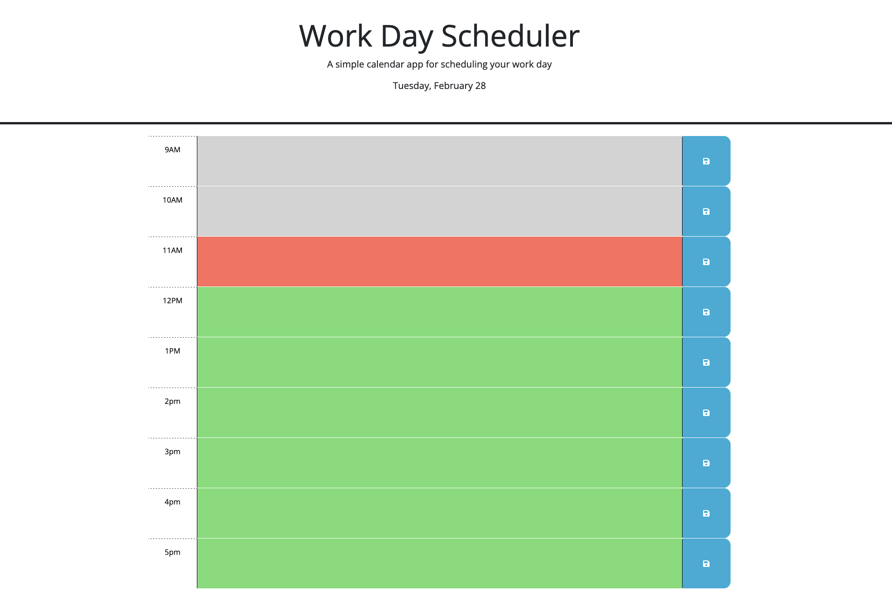

# Work-Day-Scheduler
Creating a simple Work Day Scheduler using vanilla JavaScript, DayJS, and LocalStorage to persist the data.

## Overview
The main challenge here was making sure that the callback function stored the data in a way that was unqiue, easily retrievable, and readily available outside of click events. Other than that it was more about thinking ahead and making sure that my divs were named in a way corresponding to how DayJS would be giving me back the current hour so that minimal conversion had to be done to validate.

## Link
The project can be found here [on my github.io](https://reidmadock.github.io/Work-Day-Scheduler/)

## Screenshots
This is what the site looks like when you initially load it.
